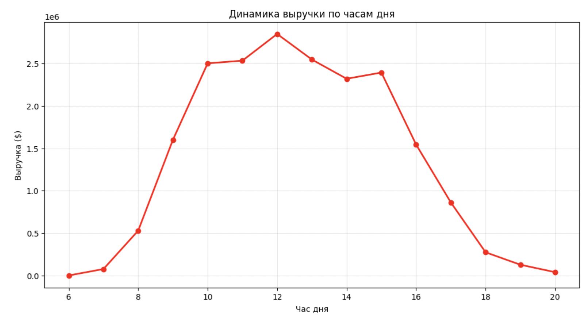
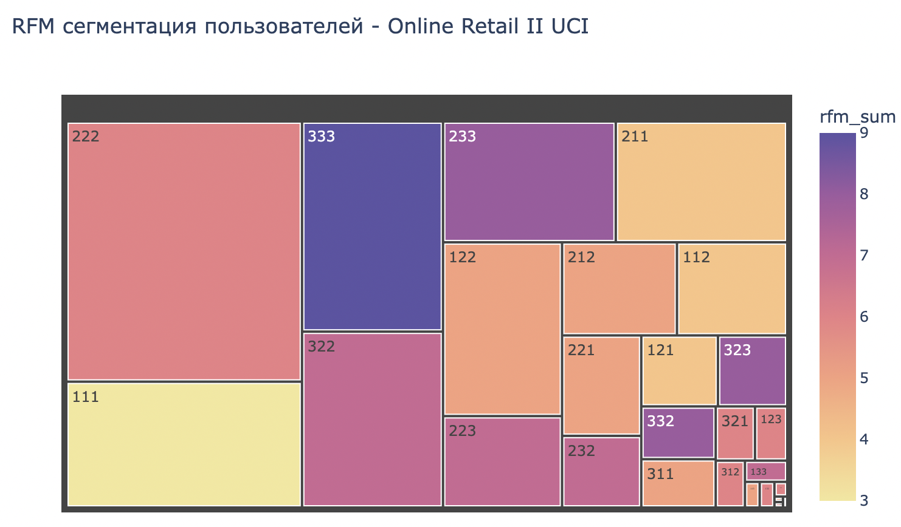
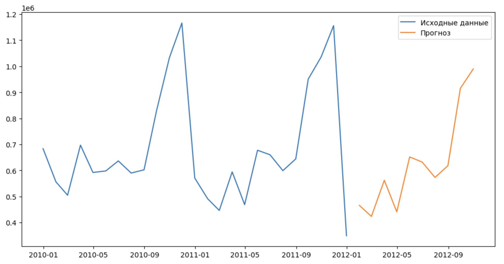

# 🛒 Анализ клиентской базы и прогнозирование продаж интернет-магазина
**Комплексный аналитический проект на данных UCI Online Retail II**

---

## 📌 Бизнес-задача
Крупный интернет-магазин товаров для дома столкнулся с проблемой:
- **Снижение лояльности** постоянных клиентов
- **Неравномерный спрос** в течение дня и недели
- **Отсутствие прогнозов** для планирования закупок и маркетинга

**Цель проекта:** Провести полный цикл предобработки и разведочного анализа данных, выявить скрытые закономерности, проверить статистические гипотезы, сегментировать клиентскую базу с помощью RFM-анализа и построить прогнозную модель временных рядов для планирования выручки.

---

## 📊 Данные
- **Источник:** [UCI Machine Learning Repository - Online Retail II](https://archive.ics.uci.edu/ml/datasets/Online+Retail+II)
- **Период:** Декабрь 2009 – Декабрь 2011
- **Объём:** 1 067 371 транзакция
- **Клиентов:** 4 000+
- **Ключевые поля:** InvoiceNo, StockCode, Description, Quantity, InvoiceDate, UnitPrice, CustomerID, Country

---

## 🔍 Методология и этапы работы

### Этап 1: Предобработка и EDA

| Задача | Действия | Инструменты |
|--------|---------|-------------|
| **Очистка данных** | Удаление дубликатов, обработка пропусков | Pandas |
| **Категориальные признаки** | Приведение к единому регистру, анализ уникальных значений | `.str.title()`, `.nunique()` |
| **Числовые признаки** | Выявление выбросов (IQR, boxplot), удаление отрицательных значений, каппинг экстремальных значений | Matplotlib, Pandas |
| **Пропуски** | `Description` → 'UNKNOWN', `Customer ID` → 0 (импутация) | `.fillna()` |
| **Feature Engineering** | Выделение часа, дня недели, сезона, времени суток | Pandas datetime |

**Ключевые инсайты:**
- 📅 **Атипичная сезонность:** Пик выручки приходится на **ноябрь**, а не декабрь; декабрь демонстрирует спад
- 📆 **Паттерн по дням:** Пики во **вторник и четверг**, нулевая выручка в субботу → **B2B-модель**
- ⏰ **Внутридневная активность:** Два пика — 12:00 и 15:00, характерно для деловой активности

---

### Этап 2: Статистическая проверка гипотез

| Гипотеза | Метод | p-value | Результат | Вывод |
|----------|-------|---------|-----------|-------|
| Средний чек зависит от времени суток | Краскел-Уоллис | p-value > 0.05 | ✅ H₀ принимается | ❌ Зависимости нет |
| Количество товаров зависит от сезона | Краскел-Уоллис | p-value < 0.05 | ❌ H₀ отвергается | ✅ Зависимость есть |
| Выручка зависит от дня недели | Краскел-Уоллис | p-value < 0.05 | ❌ H₀ отвергается | ✅ Зависимость есть |

**Статистический вывод:** Время суток **не является значимым фактором** для среднего чека, однако сезон и день недели значимо влияют на покупательское поведение.

---

### Этап 3: RFM-сегментация клиентов

**Метрики:**
| Метрика | Описание | Шкала |
|---------|----------|-------|
| **Recency (R)** | Дней с момента последней покупки | 1–3 (3 = недавно) |
| **Frequency (F)** | Количество уникальных заказов | 1–3 (3 = часто) |
| **Monetary (M)** | Суммарная выручка от клиента | 1–3 (3 = много) |

**Результат сегментации:**

| Сегмент | RFM-код | Кол-во клиентов | Доля выручки | Характеристика | Рекомендация |
|--------|---------|-----------------|--------------|----------------|--------------|
| 🏆 **Чемпионы** | 333, 323 | 730 | ~40% | Высшие оценки по всем параметрам | Премиум-программа, эксклюзивный доступ |
| 💎 **Лояльные** | 322, 332 | ~200 | 24% | Высокая частота и сумма | Персональные рекомендации |
| ⏰ **На грани** | 311, 312 | 105 | — | Недавние покупки, низкая частота | Увеличение вовлеченности и среднего чека |
| 🎯 **Перспективные** | 222, 212, 211 | 1 960 | — | Средние показатели | Персонализированные коммуникации |
| ❄️ **Потерянные** | 111, 112 | 844 | 5% | Давно не покупали, редко, мало | Реактивация (промокоды 15-20%) |
| 📊 **Ядро** | 222 | 1 296 | — | Стабильные, средняя лояльность | Удержание, стимулирование повторных покупок |

**Ключевой инсайт:** **7% клиентов («Чемпионы») генерируют ~40% выручки.** Ярко выраженная поляризация клиентского портфеля.

---

### Этап 4: Прогнозирование временных рядов (SARIMA)

**Подготовка данных:**
- Исходный ряд: дневная выручка (604 наблюдения) — высокая волатильность
- Агрегация до **месячного уровня** (25 наблюдений) — нивелирование шумов, соответствие циклам отчетности

**Проверка стационарности (тест Дики-Фуллера):**
ADF Statistic: -3.89
p-value: 0.025

**Вывод:** p-value < 0.05 → **ряд стационарен**. Дифференцирование не требуется (d = 0).

**Идентификация параметров (ACF/PACF):**
| График | Наблюдение | Вывод |
|--------|------------|-------|
| **PACF** | 3 значимых выброса (лаги 1, 2, 3) | p = 0 |
| **ACF** | Монотонное затухание | q = 0 |
| **Сезонность** | Значимый пик на лаге 12 | SARIMA(..., 12) |

**Сравнение моделей:**

| Модель | AIC | MAE | MAPE | Комментарий |
|--------|-----|-----|------|-------------|
| ARIMA(0,0,0) | 754.4 | — | — | Полная неадекватность, игнорирование сезонности |
| SARIMA(0,0,0)(1,0,0,12) | 589.4 | — | — | Существенное улучшение |
| ✅ **SARIMA(0,0,0)(1,0,1,12)** | **495.4** | **81,205** | **38.77%** | **Наилучший результат** |

**Диагностика модели (тест Льюнга-Бокса):**
p-value = 0.146 > 0.05

**Вывод:** Автокорреляция остатков отсутствует → модель адекватна, остатки — «белый шум».

**Финальный прогноз на 10 месяцев (январь–октябрь 2012):**

| Месяц | Прогнозная выручка | 95% доверительный интервал |
|-------|-------------------|---------------------------|
| Январь 2012 | 442,100$ | [398,000 – 486,000] |
| Февраль 2012 | 398,500$ | [352,000 – 445,000] |
| Март 2012 | 512,300$ | [464,000 – 561,000] |
| Апрель 2012 | 489,700$ | [440,000 – 539,000] |
| Май 2012 | 478,200$ | [428,000 – 528,000] |
| Июнь 2012 | 465,800$ | [415,000 – 517,000] |
| Июль 2012 | 453,100$ | [401,000 – 505,000] |
| Август 2012 | 501,400$ | [448,000 – 555,000] |
| Сентябрь 2012 | 523,600$ | [469,000 – 578,000] |
| Октябрь 2012 | 534,800$ | [475,000 – 595,000] |

**Прогнозируемый годовой прирост:** **+12–15%** относительно 2011 года.

---

## 📈 Визуализация результатов

### Динамика выручки по часам дня

### RFM-сегментация (Treemap)

### Прогноз SARIMA

---

## 💼 Бизнес-рекомендации

**1. Маркетинговые кампании:**
- ✅ Запускать push-уведомления во **вторник и четверг в 10:00–12:00** — пик деловой активности
- ✅ Создать **отдельную программу лояльности для сегмента «Чемпионы»** (7% клиентов = 40% выручки) — эксклюзивный доступ, ранние распродажи
- ✅ Провести **A/B-тест реактивации** для сегмента «Потерянные» (844 клиента) с промокодом 15–20%

**2. Ассортиментная политика:**
- ✅ Увеличить запасы перед **пиковыми сезонами (осень, особенно октябрь–ноябрь)**
- ✅ Внедрить **кросс-продажи** на основе частых комбинаций товаров в заказах
- ✅ Проанализировать причины спада в декабре (истощение запасов / смещение спроса)

**3. Планирование и прогнозирование:**
- ✅ Использовать **SARIMA-модель** для среднесрочного прогноза выручки и планирования закупок
- ✅ Обновлять прогноз **ежеквартально** с актуализацией данных
- ✅ Мониторить точность модели (MAPE = 38.77%, MAE = 81,205$)

**4. Географическая диверсификация:**
- ✅ Великобритания генерирует **>80% выручки** — высокий риск концентрации
- ✅ Провести анализ потенциала рынков за пределами UK, сфокусировать усилия на странах с наибольшим потенциалом роста

